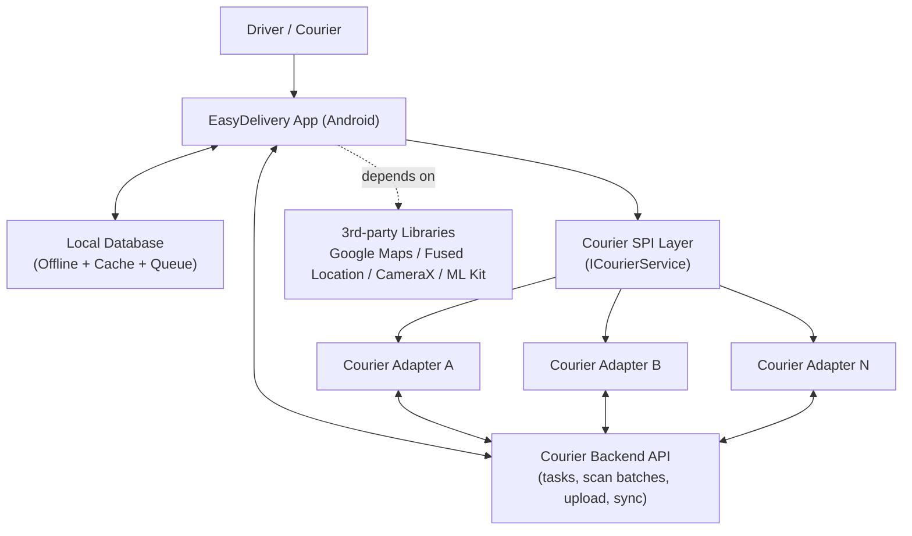
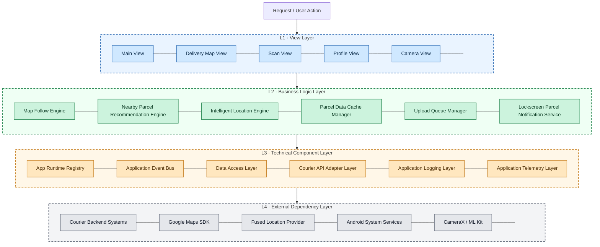

# EasyDelivery

<video src="https://raw.githubusercontent.com/white-hf/easydelivery/branch_delivery_driver/docs/media/Travel_and_show_a_package.mp4" width="100%" controls muted>
  您的浏览器不支持 video 标签.
</video>

**EasyDelivery** is a package delivery Android app designed to be efficient, user-friendly, and capable of functioning without a network connection. With a clean and intuitive interface, EasyDelivery can be easily extended to support various courier services.

## Why I Created This Project

During my work developing applications for package delivery drivers, I encountered significant challenges with the apps provided by the head office. These apps often had the following issues:

1. **Network Dependency**: The apps heavily relied on network connectivity, making numerous unnecessary backend API calls each time a UI was accessed. This caused slow operations and made the app unusable in areas with poor network coverage, such as inside buildings.
   
2. **Complex UI Design**: The user interface was overly complicated. Submitting a delivery task required switching between multiple screens, wasting valuable time during deliveries.
   
3. **Battery Drain**: The app frequently and periodically retrieved GPS information, which quickly drained the device's battery.

**EasyDelivery** addresses these issues by offering a more streamlined, efficient, and reliable solution for package delivery.

## Product Design

### Product Goals

1. **Business Continuity First**: Keep delivery operations running even under no network, weak network, or backend service outages, with reliable local-first execution and deferred synchronization.
2. **Delivery Efficiency First**: Optimize for parcel-navigation workflows with real-time follow, automatic next-stop guidance, camera automation, auto-switch to the next parcel, and smart recommendation of nearby N parcels.
3. **Error Prevention First**: Reduce wrong-drop and wrong-package risks through parcel-bound workflows, location-aware validation, and guarded operational steps.

### Core Product Capabilities

1. **Parcel Navigation Map**: Show driver position and pending parcels in one workflow, with continuous map follow for parcel-delivery navigation scenarios.
2. **Proximity-based Info Card and Next-stop Handoff**: Surface parcel information only in the last-mile zone, then automatically recommend and hand off to the next nearby parcel after completion.
3. **Adaptive Auto Zoom for Delivery Context**: Dynamically zoom in for final-approach street-level detail and zoom out for longer driving segments.
4. **Smart Camera Delivery Workflow**: Support waybill/drop-off/building capture stages with camera assistance and fast context switching for same-location multi-parcel continuous capture.
5. **Offline-first Execution with Deferred Sync**: Continue scanning/capture/submission without connectivity and automatically upload with retry when network returns.
6. **Lockscreen Delivery Focus**: Show only the currently actionable parcel information while the device is locked.
7. **Low-interruption Driver Flow**: Reduce unnecessary page switching and disruptive prompts in core delivery operations.

### Supporting Driver Utilities

These capabilities are designed to address real-world needs beyond the core dispatch loop.

1. **My Work**: Visualizes the driver’s daily and monthly workload to support review and self-management.
2. **My Large Parcels**: Pre-marks special parcels to reduce on-site misses and repeated communication.

## Technologies Applied

- **Modular Architecture**:  
  Clear module boundaries across view, domain logic, infrastructure, and external integrations for maintainability and incremental evolution.

- **SPI-based Backend Integration**:  
  Pluggable courier integration via `ICourierService` and factory/adapter patterns, enabling backend replacement without changing core app flows.

- **Policy/Strategy/Pipeline-driven Location Engine**:  
  A composable location architecture (policy + strategy + processing pipeline + state machine) to dynamically apply quality gating, realtime vs power-save behavior, and adaptive boost control.

- **Local Persistence and DAO Abstraction**:  
  Local-first persistence through database abstraction (`MyDb`) and DAO layer for structured offline read/write and query isolation.

- **Queue-based Deferred Synchronization**:  
  Asynchronous upload queue with retry/backoff and state transitions to guarantee eventual consistency under unstable network conditions.

- **Concurrency Model for Mobile Reliability**:  
  Dedicated execution paths for UI, DB operations, upload workers, and background service tasks to reduce blocking and improve runtime stability.

- **Observability and Runtime Diagnostics**:  
  Configurable logging levels, telemetry instrumentation, and runtime diagnostics hooks for issue investigation and production tuning.

## Top-level Architecture



## Layered Module Architecture



## 🎥 Product Demo

### 📸 Smart Delivery Workflow
This video demonstrates our high-efficiency camera engine designed for high-volume delivery operations.

<a href="https://www.youtube.com/watch?v=pon8pqhOicM" target="_blank">
  
</a>

**Key Highlights:**
*   **Seamless Parcel Handoff**: Automatic switching between multiple parcels at the same stop, maintaining workflow continuity.
*   **Intelligent Auto-Capture**: Computer vision detects and matches the shipping label, triggering the shutter automatically—zero manual taps required.
*   **Rapid-Fire Batching**: Continuous capture mode for multi-item deliveries.
*   **Hands-Free Submission**: Fully automated background data syncing and submission once the delivery sequence is complete.

*EasyDelivery turns a 30-second manual process into a 5-second automated flow.*

### 🗺️ Driving Map Follow
Real-time navigation with adaptive auto-zoom and parcel visibility protection.

<a href="https://www.youtube.com/watch?v=DM9m_VVtZhA" target="_blank">
  
</a>

### Map Overview Reference


### Large Parcel Marker Reference


### Multi-parcel Map Reference


## How to Install and Run the Project

1. **Clone the repository from GitHub**:
    ```bash
    git clone https://github.com/white-hf/easydelivery.git
    ```
2. **Open the project in Android Studio**.
3. **Build the project** using the Android Studio build tools.
4. **Run the app** on an emulator or physical device.

## How to Use the Project

1. **Implement courier module**: Implement your courier module by creating a new Android Library and implementing two interfaces, ICourierService and IResponseCallBack.
2. **Modify gradle files**: First, Add "include ':app: your module name'" to settings.gradle, then add "implementation project(':app:your module name')" to build.gradle of app. 
3. **Modify config.json**: Modify the value of the key 'courier' to your module name.
4. **Add your Google Maps API key**: Add 'MAPS_API_KEY' to local.properties, the value should be your Google Maps API key.

## Future Enhancements

- **Support for Multiple Courier Services**:  
  The app architecture allows easy integration of multiple courier services, making it adaptable to various delivery systems.

- **Enhanced Offline Capabilities**:  
  Future updates will improve offline data handling, allowing for even more robust performance without network dependency.

- **Advanced Data Synchronization**:  
  Implement more sophisticated synchronization algorithms to handle complex data conflicts and ensure higher data integrity.

- **Enhanced Security Features**:  
  Incorporate advanced encryption methods to further secure sensitive delivery data both at rest and in transit.

## Risks and Mitigations

1. **Data Security**:  
   Once a package is delivered and its data is uploaded, the app deletes its data in the database to prevent any security risks.

2. **Data Inconsistency**:  
   There is a possibility that some key information might be modified during delivery, which could impact the accuracy of package deliveries. Implementing a lightweight data synchronization API helps mitigate this risk by ensuring data consistency.

## Contributing

Contributions are welcome! If you have suggestions or would like to contribute to the project, please fork the repository and submit a pull request.

## License

This project is licensed under the MIT License. See the [LICENSE](LICENSE) file for details.
